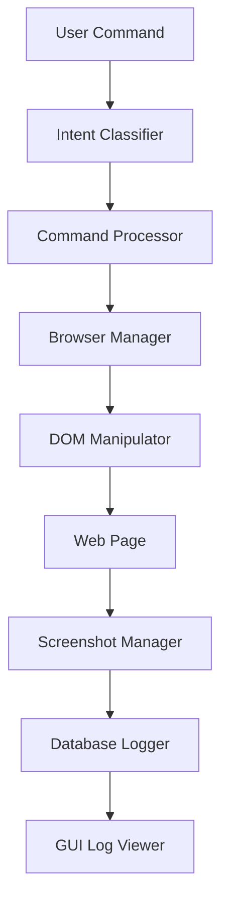

<<<<<<< HEAD
# Adam Browser 🤖🌐

**Autonomous AI Agent Browser Application**

Adam Browser is a sophisticated AI-powered browser automation system that understands natural language commands and executes complex web interactions including form filling, navigation, travel booking, and map directions.


## 🚀 Features

### 🧠 AI-Powered Automation
- **Natural Language Processing**: Uses BERT for intent classification and command understanding
- **Smart Element Detection**: Advanced DOM manipulation with fuzzy matching and fallback selectors
- **Context Awareness**: Maintains session context for multi-step operations
- **Offline Capability**: Local BERT model for privacy and offline operation

### 🌐 Browser Automation
- **Playwright Integration**: Robust browser automation with Chrome, Firefox, and WebKit support
- **Custom Chrome Support**: Use your system Chrome browser for familiar experience
- **Multi-Context Management**: Isolated browsing sessions with independent cookies and storage
- **Screenshot Capture**: Automated screenshot capture with configurable intervals

### ✈️ Specialized Automation
- **Expedia Integration**: Automated flight, hotel, and car rental booking
- **Google Maps Navigation**: Intelligent route planning and directions
- **Universal Form Filling**: Automatic form detection and completion
- **Smart Scrolling & Clicking**: Context-aware page interaction

### 🖥️ User Interface
- **wxPython GUI**: Native desktop interface with real-time logging
- **Command Line Interface**: Rich terminal interface with interactive mode
- **System Tray Integration**: Minimize to tray with quick access
- **Real-time Monitoring**: Live status updates and performance metrics

### 🔒 Security & Privacy
- **Encrypted Credential Storage**: AES-256 encryption for sensitive data
- **Local Processing**: BERT model runs locally for privacy
- **Session Isolation**: Sandboxed browser contexts
- **Audit Logging**: Comprehensive activity logging for compliance

## 📦 Installation

### Prerequisites
- Python 3.11 or higher
- Windows 10/11 (primary support)
- 4GB+ RAM recommended
- Chrome browser (optional, for custom browser support)

### Quick Install
```bash
# Clone the repository
git clone https://github.com/ai-in-pm/AdamBrowser.git
cd AdamBrowser

# Install dependencies
pip install -r requirements.txt

# Install Playwright browsers
playwright install chromium

# Run Adam Browser
python -m adam_browser.main
```

### Development Install
```bash
# Install in development mode
pip install -e .

# Install development dependencies
pip install -r requirements.txt[dev]

# Run tests
pytest tests/
```

## 🎯 Quick Start

### GUI Mode
```bash
# Start the GUI application
python -m adam_browser.main

# Or use the installed command
adam-browser
```

### CLI Mode
```bash
# Start interactive CLI
adam-browser --cli

# Execute single command
adam-browser --cli execute "go to google.com"
```

### Example Commands

#### Basic Navigation
```
"Go to google.com"
"Navigate to https://github.com"
"Open YouTube"
```

#### Search & Interaction
```
"Search for Python tutorials"
"Click the login button"
"Type hello world in the search box"
"Scroll down 3 times"
```

#### Travel Booking
```
"Book a flight from NYC to LA"
"Find hotels in Paris for next weekend"
"Rent a car in Miami"
```

#### Navigation
```
"Get directions from home to work"
"Directions to the nearest airport"
"Route to downtown Seattle"
```

## ⚙️ Configuration

Adam Browser uses `adam.config.toml` for configuration:

```toml
[general]
app_name = "Adam Browser"
debug_mode = false
offline_mode = false

[browser]
default_browser = "chromium"
browser_path = "C:\\Program Files\\Google\\Chrome\\Application\\chrome.exe"
headless = false
timeout = 30000

[ai]
model_path = "./bert-base-uncased-mrpc/bert-base-uncased-mrpc"
use_local_model = true
confidence_threshold = 0.7

[gui]
window_width = 1200
window_height = 800
minimize_to_tray = true
```

## 🏗️ Architecture

### Core Components

```
adam_browser/
├── agent/              # AI agent logic
│   ├── agent.py       # Main agent controller
│   ├── intent_classifier.py  # NLP intent recognition
│   └── command_processor.py  # Command execution
├── browser/           # Browser automation
│   ├── browser_manager.py    # Playwright integration
│   ├── dom_manipulator.py    # DOM interaction
│   └── screenshot_manager.py # Screenshot capture
├── navigator/         # Specialized automation
│   ├── expedia_navigator.py  # Travel booking
│   └── maps_navigator.py     # Google Maps
├── gui/              # User interface
│   ├── main_window.py        # Main GUI window
│   ├── log_viewer.py         # Real-time logging
│   └── config_panel.py       # Configuration UI
├── database/         # Data persistence
│   ├── database_manager.py   # SQLite operations
│   └── session_logger.py     # Activity logging
└── security/         # Security & encryption
    └── vault.py              # Credential storage
```

### Data Flow



## 🧪 Testing

```bash
# Run all tests
pytest

# Run with coverage
pytest --cov=adam_browser

# Run specific test category
pytest tests/test_agent.py
pytest tests/test_browser.py
pytest tests/test_gui.py
```

## 📊 Performance

### Benchmarks
- **Command Processing**: ~2-5 seconds average
- **Page Navigation**: ~3-8 seconds depending on site
- **Form Filling**: ~1-3 seconds per field
- **Screenshot Capture**: ~0.5-1 second
- **Memory Usage**: ~200-500MB typical

### Optimization Features
- **Lazy Loading**: Components initialized on demand
- **Connection Pooling**: Reuse browser contexts
- **Caching**: Intent classification caching
- **Background Processing**: Async command queue

## 🔧 Development

### Setting Up Development Environment

```bash
# Clone and setup
git clone https://github.com/ai-in-pm/AdamBrowser.git
cd AdamBrowser

# Create virtual environment
python -m venv venv
source venv/bin/activate  # On Windows: venv\Scripts\activate

# Install development dependencies
pip install -e .[dev]

# Install pre-commit hooks
pre-commit install

# Run development server
python -m adam_browser.main --debug
```

### Code Style
- **Black**: Code formatting
- **Flake8**: Linting
- **MyPy**: Type checking
- **Pre-commit**: Automated checks

### Contributing
1. Fork the repository
2. Create a feature branch
3. Make your changes
4. Add tests
5. Run the test suite
6. Submit a pull request

## 📝 License

This project is licensed under the MIT License - see the [LICENSE](LICENSE) file for details.

## 🤝 Support

- **Documentation**: [docs.adambrowser.ai](https://docs.adambrowser.ai)
- **Issues**: [GitHub Issues](https://github.com/ai-in-pm/AdamBrowser/issues)
- **Discussions**: [GitHub Discussions](https://github.com/ai-in-pm/AdamBrowser/discussions)
- **Email**: team@adambrowser.ai

## 🎉 Acknowledgments

- **Playwright Team**: For excellent browser automation framework
- **Hugging Face**: For BERT models and transformers library
- **wxPython Team**: For cross-platform GUI framework
- **Microsoft**: For DialoGPT and AI research
- **OpenAI**: For inspiration and AI advancement

## 🗺️ Roadmap

### Version 1.1
- [ ] Firefox and Safari support
- [ ] Voice command integration
- [ ] Mobile browser automation
- [ ] Plugin system

### Version 1.2
- [ ] Multi-language support
- [ ] Cloud synchronization
- [ ] Advanced analytics
- [ ] API endpoints

### Version 2.0
- [ ] GPT-4 integration
- [ ] Computer vision
- [ ] Workflow automation
- [ ] Enterprise features

---

**Made with ❤️ by AI in PM**
